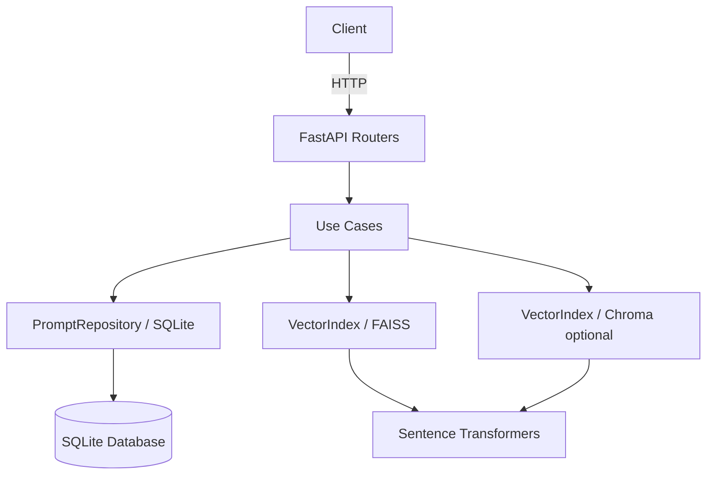
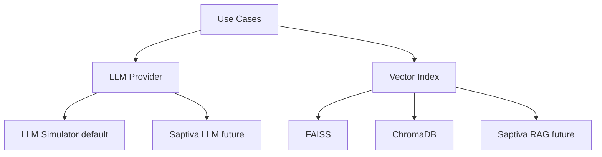

# Reto Técnico – Microservicio de Prompts con FastAPI + FAISS (Core) + Chroma (Opcional)

Este proyecto responde a un **reto técnico** con objetivo explícito:

1. Exponer una **API REST** con dos endpoints:
   - `POST /prompt`: recibe un prompt, lo procesa con una **función LLM simulada (determinista)** y guarda prompt + respuesta.
   - `GET /similar`: recibe un prompt nuevo y devuelve los más parecidos usando **FAISS o librería similar**.
2. Entregar un servicio **reproducible, claro y autocontenido**.

---

## Núcleo del proyecto: lo que se esta evaluando

- **API REST con FastAPI**
  - `POST /prompt`: genera respuesta simulada y persiste; calcula embedding y lo indexa en FAISS.
  - `GET /similar`: calcula embedding de la query y consulta top‑k similares.

- **Persistencia**
  - **SQLite + SQLModel** para prompts y metadatos.
  - **FAISS (IndexFlatIP)** como motor vectorial base.

- **Embeddings**
  - `sentence-transformers/all-MiniLM-L6-v2` (384 dims) + normalización L2 → similitud coseno.

- **Calidad**
  - Tipos (mypy), estilo (ruff), tests (pytest), CI (GitHub Actions).

---

##  Arquitectura (Hexagonal)

- **Dominio (POO + `@dataclass`)**: entidades inmutables y objetos de valor.
- **Puertos (interfaces)**: `PromptRepository`, `VectorIndex`, `Embedder`, `LLMProvider`.
- **Adaptadores**: SQLite/SQLModel, FAISS (core), **Chroma** (opcional).
- **Casos de uso**: `CreatePrompt`, `SearchSimilar` (aplican orquestación, no I/O directo).


---

## LLM Simulado (determinista, testeable)

```python
from dataclasses import dataclass
from hashlib import sha256

class LLMProvider:
    def generate(self, prompt: str) -> str:  # Puerto
        raise NotImplementedError

class LLMSimulator(LLMProvider):  # Sustituible por un adapter real sin tocar los casos de uso
    def generate(self, prompt: str) -> str:
        digest = int(sha256(prompt.encode()).hexdigest(), 16)
        seed = digest % 10000
        keywords = " ".join(prompt.lower().split()[:3])
        return f"[SimResponse-{seed}] Respuesta generada sobre: {keywords}"

@dataclass(frozen=True)
class PromptRecord:
    id: str
    prompt: str
    response: str
    created_at: str  # ISO8601
```

> **SOLID aplicado**: 
> - **S**ingle Responsibility: simulador sólo genera texto; casos de uso orquestan; repos guardan.
> - **O**pen/Closed: agregar `SaptivaLLMAdapter` o `ChromaIndex` sin modificar casos de uso.
> - **L**iskov: cualquier `LLMProvider` respeta el mismo contrato.
> - **I**nterface Segregation: puertos pequeños y específicos.
> - **D**ependency Inversion: casos de uso dependen de **abstracciones**, no de implementaciones.

---

## Estructura del proyecto

```
.
├── api/             # Routers FastAPI
├── core/            # Config, logging
├── domain/          # Entidades (@dataclass) y puertos (ABCs)
├── infra/           # Adaptadores: sqlite_repo.py, faiss_index.py, chroma_index.py
├── use_cases/       # create_prompt.py, search_similar.py
├── tests/           # unit & integration
├── scripts/         # seeds, mantenimiento del índice
├── data/            # DB e índices persistidos
└── README.md
```

---

##  Instalación y ejecución (Core = FAISS)

**Requisitos**: Python 3.9+, FAISS 1.7+, Torch 2.0+, pip 24+

```bash
git clone https://github.com/JazzzFM/SaptivaTekChallenge.git
cd SaptivaTekChallenge

python -m venv venv
source venv/bin/activate
pip install -r requirements.txt

uvicorn api.main:app --reload
```

Swagger UI: http://localhost:8000/docs  
ReDoc: http://localhost:8000/redoc

---

## Ejemplos

```bash
# Crear un prompt
curl -s -X POST http://localhost:8000/prompt   -H "Content-Type: application/json"   -d '{"prompt":"Cómo optimizo un ETL con PySpark?"}' | jq

# Buscar similares
curl -s "http://localhost:8000/similar?query=Optimizar jobs de Spark&k=3" | jq
```

---

##  Backend vectorial alternativo: Chroma (opcional)

Se soporta **ChromaDB** como “librería similar” a FAISS sin alterar los casos de uso.

**Activación por variable de entorno**:
```bash
export VECTOR_BACKEND=chroma   # por defecto: faiss
```

**Notas**:
- Persistencia en `data/chroma/`.
- Soporta **metadata** y **filtros**.
- Satisface el requerimiento del reto sin añadir dependencias externas remotas.

---

## Extensiones futuras: Saptiva (planteamiento de extension futura, no activo)

El diseño permite integrar **Saptiva LLM** y **Saptiva RAG** como adaptadores:



> Se documenta **cómo** enchufarlo, pero no se incluye ningun runtime ni claves para preservar **reproducibilidad**.

---

## ✅ Tests

```bash
pytest --cov=.
```

- **Unitarios**: simulador, normalización de embeddings, contrato de `VectorIndex` (doble fáctico vs. brute-force).
- **Integración**: `POST /prompt` → `GET /similar`, orden por score y estabilidad determinista.

---

## 📦 Docker

```bash
docker build -t prompt-service .
docker run -p 8000:8000 -e VECTOR_BACKEND=faiss prompt-service
```

---

## 📌 Roadmap

- [ ] API key simple (rate limit + CORS).
- [ ] Exportar embeddings a Parquet.
- [ ] Backend alternativo **Chroma** (activable por env) con filtros de metadata.
- [ ] Stubs de `SaptivaLLMAdapter` y `SaptivaRAGAdapter` + docs.

---

## 📜 Licencia

MIT. Proyecto desarrollado como respuesta a un reto técnico.
