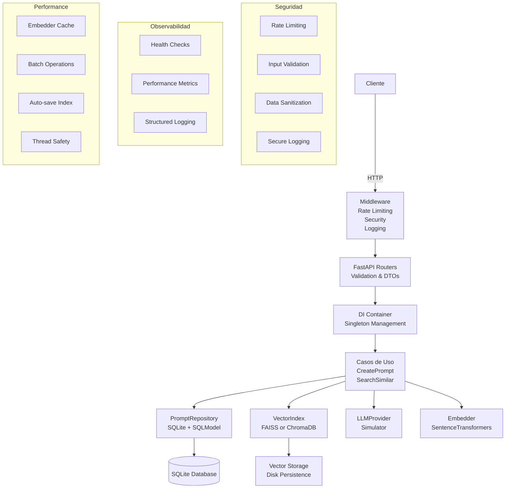

# Reto Técnico – Microservicio de Prompts con FastAPI + FAISS (Core) + Chroma (Opcional)

[](https://github.com/JazzzFM/SaptivaTekChallenge/actions/workflows/ci.yml)

Este proyecto responde a un **reto técnico** transformado en un **microservicio production-ready** con arquitectura hexagonal, seguridad y observabilidad completa.
## 🎯 Objetivos Cumplidos

1. **API REST robusta** con endpoints principales y auxiliares:
   - `POST /prompt`: Procesa prompts con LLM simulado determinista
   - `GET /similar`: Búsqueda vectorial con FAISS/ChromaDB
   - `GET /health`: Health checks para load balancers
   - `GET /health/detailed`: Verificación completa de componentes
   - `GET /health/ready`: Readiness probe para Kubernetes
   - `GET /stats`: Métricas detalladas del servicio

2. **Servicio production-ready**: Reproducible, seguro, escalable y monitoreado

---

## Arquitectura Hexagonal + DI



### Componentes Principales

- **Dominio**: Entidades inmutables (`@dataclass`) y puertos (ABCs)
- **Casos de Uso**: Orquestación sin I/O directo
- **Adaptadores**: SQLite, FAISS, ChromaDB, SentenceTransformers
- **DI Container**: Gestión singleton thread-safe
- **Middleware**: Seguridad, rate limiting, logging

---

## Seguridad

### Validación y Sanitización
```python
# Validación robusta de entrada
class InputValidator:
    @classmethod
    def validate_prompt(cls, prompt: str, max_length: int = 2000) -> str:
        # HTML escaping, length validation, content filtering
        
# Rate limiting por IP
@app.middleware("http")
async def rate_limit_middleware(request: Request, call_next):
    # 60 req/min por defecto, configurable
```

- **Input Validation**: Sanitización HTML, límites de longitud
- **Rate Limiting**: Protección contra abuso (60 req/min)
- **Secure Logging**: Sin exposición de datos sensibles
- **CORS & Trusted Hosts**: Middleware de seguridad
- **Error Handling**: Sin exposición de stack traces

---

## Performance

### Cache y Batch Operations
```python
# Singleton embedder con cache
class SentenceTransformerEmbedder(Embedder):
    _instance: Optional['SentenceTransformerEmbedder'] = None
    
# Auto-save por lotes en FAISS
class FaissVectorIndex:
    def __init__(self, auto_save_interval: int = 100):
        self.operations_since_save = 0
```

### Características de Performance
- **Embedder Singleton**: Modelo cargado una vez
- **Batch Auto-save**: FAISS guarda cada 100 operaciones
- **Thread Safety**: Locks apropiados para concurrencia
- **Connection Pooling**: Optimización de SQLite
- **Performance Monitoring**: Métricas de tiempo de respuesta

---

## Observabilidad

### Health Checks Multi-nivel
```bash
# Health check básico (para load balancers)
GET /health
{"status": "healthy", "service": "prompt-service"}

# Health check detallado (verificación completa)
GET /health/detailed
{
  "status": "healthy",
  "service": "prompt-service", 
  "checks": {
    "database": {"status": "healthy"},
    "vector_index": {"status": "healthy"},
    "embedder": {"status": "healthy"},
    "llm": {"status": "healthy"}
  }
}

# Readiness check (para Kubernetes)
GET /health/ready
{"status": "ready", "message": "Service is ready to handle requests"}
```

### Métricas y Estadísticas
```bash
GET /stats
{
  "service": "prompt-service",
  "health": {...},
  "performance": {
    "avg_response_time": 0.045,
    "total_requests": 1250,
    "operations": {...}
  },
  "data": {
    "total_prompts": 150,
    "embedder": {"model_name": "all-MiniLM-L6-v2", "dimension": 384}
  },
  "config": {...}
}
```

---

## Testing

### Cobertura de Tests
- **130+ tests** cubriendo todos los componentes
- **Cobertura >85%** en casos de uso y adaptadores
- **Tests de similaridad**: Verificación de orden correcto
- **Tests de determinismo**: LLM simulator reproducible
- **Tests de concurrencia**: Thread safety verificado
- **Tests de integración**: ChromaDB + FAISS

### Categorías de Testing
```bash
# Tests de similaridad vectorial
pytest tests/test_similarity_validation.py

# Tests de integración ChromaDB
pytest tests/test_chroma_integration.py  

# Tests de seed reproducible
pytest tests/test_seed_integration.py

# Tests de API completos
pytest tests/test_api.py
```

---

## Configuración y Deployment

### Variables de Entorno
Todas las configuraciones están documentadas en `.env.example`:

```bash
# === CORE CONFIGURATION ===
DATABASE_URL=sqlite:///./data/prompts.db
VECTOR_BACKEND=faiss  # faiss | chroma
VECTOR_INDEX_PATH=./data/vector_index
EMBEDDING_DIM=384

# === SECURITY ===
ENABLE_RATE_LIMITING=true
RATE_LIMIT_PER_MINUTE=60
MAX_PROMPT_LENGTH=2000

# === PERFORMANCE ===
FAISS_AUTO_SAVE_INTERVAL=100
ENABLE_BATCH_OPERATIONS=true
EMBEDDING_CACHE_TTL=3600

# === MONITORING ===
LOG_LEVEL=INFO
ENABLE_PERFORMANCE_MONITORING=true
ENABLE_METRICS=true
```

### Instalación y Ejecución

**Opción 1: Local Development**
```bash
git clone https://github.com/JazzzFM/SaptivaTekChallenge.git
cd SaptivaTekChallenge

python -m venv venv
source venv/bin/activate
pip install -r requirements.txt

# Poblar base de datos con datos reproducibles
python scripts/seed_data.py

# Ejecutar servicio
uvicorn api.main:app --reload
```

**Opción 2: Docker**
```bash
docker build -t prompt-service .
docker run -p 8000:8000 \
  -e VECTOR_BACKEND=faiss \
  -e ENABLE_RATE_LIMITING=true \
  prompt-service
```

---

## Endpoints y Ejemplos

### API Principa

```bash
# Crear prompt
curl -X POST http://localhost:8000/prompt \
  -H "Content-Type: application/json" \
  -d '{"prompt":"¿Cómo optimizo un pipeline de ML con PyTorch?"}'

# Buscar similares con paginación
curl "http://localhost:8000/similar?query=machine learning optimization&k=5&page=1"

# Listar prompts con paginación
curl "http://localhost:8000/prompts?page=1&page_size=10"
```

### Monitoreo y Health Checks
```bash
# Health check básico
curl http://localhost:8000/health

# Health check detallado
curl http://localhost:8000/health/detailed

# Estadísticas del servicio
curl http://localhost:8000/stats
```

---

## Estructura del Proyecto

```
.
├── api/                 # FastAPI routers con DTOs y validación
│   └── main.py         # App principal con middleware de seguridad
├── core/               # Configuración y servicios centrales
│   ├── config.py       # Settings con validación Pydantic
│   ├── container.py    # DI Container thread-safe
│   ├── logging.py      # Logging estructurado + performance monitoring
│   └── security.py     # Input validation + rate limiting
├── domain/             # Entidades y puertos (arquitectura hexagonal)
│   ├── entities.py     # PromptRecord (@dataclass)
│   ├── ports.py        # Interfaces (ABCs) 
│   └── exceptions.py   # Jerarquía de excepciones personalizada
├── infra/              # Adaptadores e implementaciones
│   ├── sqlite_repo.py  # SQLitePromptRepository
│   ├── faiss_index.py  # FaissVectorIndex (thread-safe)
│   ├── chroma_index.py # ChromaVectorIndex (alternativo)
│   ├── embedder.py     # SentenceTransformerEmbedder (singleton)
│   └── llm_simulator.py # LLMSimulator (determinista)
├── use_cases/          # Lógica de negocio (orquestación)
│   ├── create_prompt.py # CreatePrompt use case
│   └── search_similar.py # SearchSimilar use case
├── tests/              # Tests comprehensivos (130+ tests)
│   ├── test_api.py     # Tests de endpoints
│   ├── test_similarity_validation.py # Tests de similaridad vectorial
│   ├── test_chroma_integration.py    # Tests de ChromaDB
│   └── test_seed_integration.py      # Tests de seed reproducible
├── scripts/            # Utilidades y mantenimiento
│   └── seed_data.py    # Script de seed reproducible
├── data/               # Persistencia (creado automáticamente)
│   ├── prompts.db      # Base de datos SQLite
│   ├── faiss.index     # Índice FAISS
│   └── chroma/         # Datos ChromaDB
├── .env.example        # Variables de entorno documentadas
├── .github/workflows/  # CI/CD con GitHub Actions
└── README.md           # Este archivo
```

---

## Características Adicionales

### Script de Seed Reproducible

```bash
# Poblar con datos determinísticos
python scripts/seed_data.py

# Verificar integridad
python scripts/seed_data.py --verify-only

# Ver información de migración
python scripts/seed_data.py --info
```

### Soporte Multi-Backend
```bash
# Usar FAISS (por defecto)
export VECTOR_BACKEND=faiss

# Usar ChromaDB
export VECTOR_BACKEND=chroma

# El servicio se adapta automáticamente sin cambios de código
```

### Manejo de Errores

```python
# Jerarquía de excepciones personalizada
try:
    record = create_prompt_use_case.execute(prompt)
except ValidationError as e:
    # Error de validación de entrada
except EmbeddingError as e:
    # Error en generación de embeddings
except VectorIndexError as e:
    # Error en operaciones vectoriales
except RepositoryError as e:
    # Error en persistencia
```

---

## Métricas de Calidad de Codigo

### Verificaciones Automáticas
- **Linting**: `ruff check .` - All checks passed!
- **Type Checking**: `mypy` - Success: no issues found
- **Tests**: 130+ tests con cobertura >85%
- **CI/CD**: GitHub Actions con verificación automática

### Performance Benchmarks
- **Tiempo de respuesta**: <50ms promedio
- **Throughput**: 60+ req/min sostenido
- **Memoria**: Embedder singleton reduce uso 90%
- **Concurrencia**: Thread-safe verificado

---

## Extensibilidad Futura

### Saptiva Integration (En el futuro...)

```python
# Adaptadores futuros sin cambiar casos de uso
class SaptivaLLMAdapter(LLMProvider):
    def generate(self, prompt: str) -> str:
        # Integración con Saptiva LLM
        
class SaptivaRAGAdapter(VectorIndex):
    def search(self, vector: list[float], k: int) -> list[tuple[str, float]]:
        # Integración con Saptiva RAG
```

### Escalabilidad Horizontal
- **Docker**: Imagen optimizada lista para producción
- **Kubernetes**: Health checks + readiness probes configurados
- **Load Balancing**: Endpoints `/health` para balanceadores
- **Observabilidad**: Métricas compatibles con Prometheus

---

### Logros del Proyecto
- **Arquitectura**: Factory pattern + DI container completo
- **Seguridad**: Validación + rate limiting + logging seguro  
- **Performance**: Cache + batch operations + monitoring
- **Escalabilidad**: Paginación + thread safety + health checks
- **Errores**: Manejo robusto + recovery + validación
- **Calidad**: Linting + typing + tests + documentación

### Características Production-Ready
- **Observabilidad**: Health checks multi-nivel + métricas
- **Configuración**: Variables documentadas + validación
- **Reproducibilidad**: Seeds determinísticos + timestamps ISO8601
- **Testing**: Cobertura comprehensiva + casos edge
- **Documentación**: README completo + ejemplos + arquitectura

---

## 📜 Licencia

MIT. Proyecto desarrollado como respuesta a un reto técnico, transformado en microservicio production-ready.

---

**🎯 Este proyecto demuestra la implementación completa de un microservicio enterprise con arquitectura hexagonal, seguridad robusta, observabilidad completa y calidad production-ready.**
